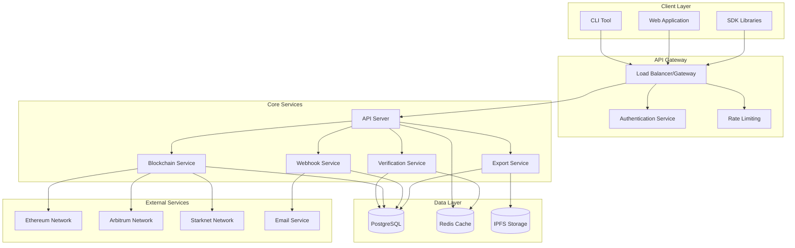
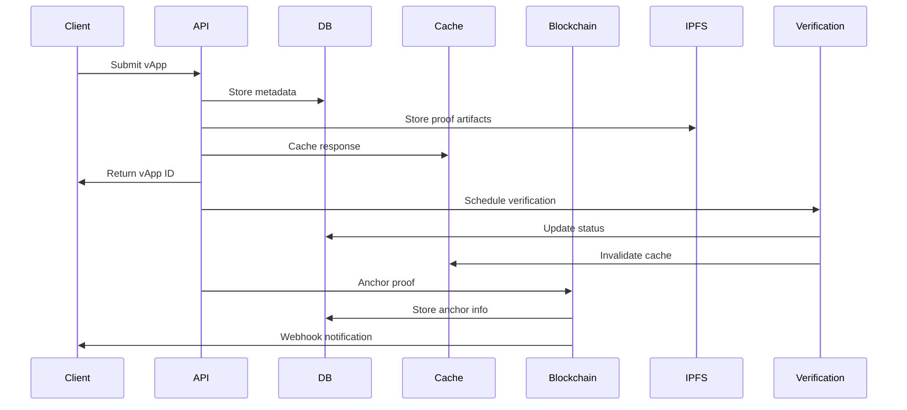
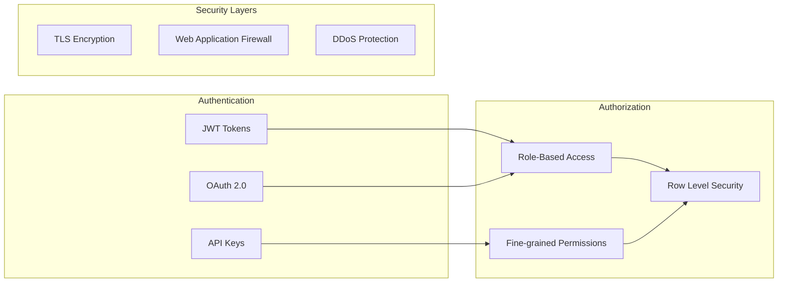
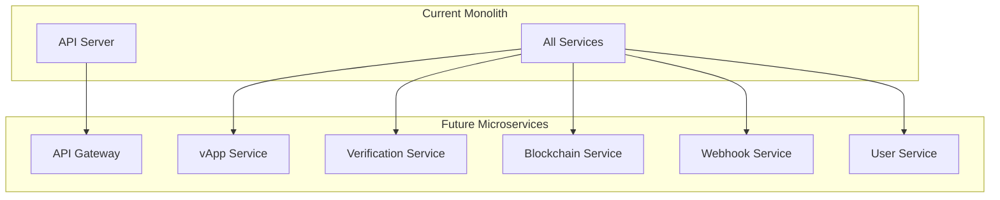

# OpenvApps Hub Architecture
This document provides a comprehensive overview of the OpenvApps Hub architecture, design decisions, and system components.
## 🏗️ System Overview
OpenvApps Hub is designed as a scalable, chain-agnostic platform for verifiable applications with zero-knowledge proofs. The architecture follows microservices principles with clear separation of concerns.

## 🎯 Design Principles
### 1. Chain Agnostic
- Support multiple blockchain networks
- Pluggable blockchain adapters
- Unified interface for all chains
### 2. Scalability
- Horizontal scaling capabilities
- Stateless service design
- Efficient caching strategies
### 3. Security First
- Zero-trust architecture
- End-to-end encryption
- Comprehensive audit trails
### 4. Developer Experience
- Simple API design
- Comprehensive documentation
- Multiple SDK options
### 5. Community Driven
- Open governance model
- Transparent verification process
- Community moderation tools
## 🔧 Core Components
### API Server
**Technology**: Fastify + TypeScript
**Responsibilities**:
- HTTP request handling
- Input validation and sanitization
- Authentication and authorization
- Rate limiting
- Response formatting
```typescript
// Example API structure
interface APIServer {
  routes: {
    vapps: VAppRoutes;
    verification: VerificationRoutes;
    blockchain: BlockchainRoutes;
    webhooks: WebhookRoutes;
    users: UserRoutes;
  };
  middleware: {
    auth: AuthMiddleware;
    validation: ValidationMiddleware;
    rateLimit: RateLimitMiddleware;
    logging: LoggingMiddleware;
  };
}
```
**Key Features**:
- RESTful API design
- OpenAPI 3.0 specification
- Comprehensive error handling
- Request/response logging
- Health check endpoints
### Verification Service
**Responsibilities**:
- Zero-knowledge proof verification
- Verifier node management
- Verification result caching
- Performance monitoring
```typescript
interface VerificationService {
  verifyProof(proof: ProofData): Promise<VerificationResult>;
  scheduleVerification(vappId: string): Promise<void>;
  getVerificationStatus(id: string): Promise<VerificationStatus>;
  manageVerifierNodes(): Promise<void>;
}
```
**Verification Flow**:
1. Receive proof submission
2. Validate proof format
3. Queue for verification
4. Assign to available verifier node
5. Execute verification
6. Store results
7. Trigger webhooks
### Blockchain Service
**Responsibilities**:
- Multi-chain proof anchoring
- Transaction monitoring
- Gas optimization
- Cross-chain verification
```typescript
interface BlockchainService {
  anchorProof(proof: ProofHash, chain: Chain): Promise<AnchorResult>;
  verifyAnchor(hash: string, chain: Chain): Promise<boolean>;
  getTransactionStatus(txHash: string): Promise<TransactionStatus>;
  estimateGas(operation: Operation): Promise<GasEstimate>;
}
```
**Supported Chains**:
- **Ethereum**: Primary anchoring chain
- **Arbitrum**: L2 scaling solution
- **Starknet**: ZK-rollup integration
- **Polygon**: Alternative L2 option
### Webhook Service
**Responsibilities**:
- Event notification delivery
- Retry logic and failure handling
- Webhook endpoint validation
- Delivery tracking and analytics
```typescript
interface WebhookService {
  registerWebhook(config: WebhookConfig): Promise<Webhook>;
  deliverEvent(event: WebhookEvent): Promise<void>;
  retryFailedDeliveries(): Promise<void>;
  validateEndpoint(url: string): Promise<boolean>;
}
```
**Event Types**:
- Verification completed/failed
- Proof anchored to blockchain
- vApp flagged by community
- Flag resolution updates
### Export Service
**Responsibilities**:
- vApp bundle generation
- Proof artifact packaging
- Download link management
- Format conversion
```typescript
interface ExportService {
  generateBundle(vappId: string, options: ExportOptions): Promise<ExportResult>;
  getDownloadLink(exportId: string): Promise<string>;
  cleanupExpiredExports(): Promise<void>;
}
```
## 💾 Data Architecture
### Database Design
**Primary Database**: PostgreSQL 14+
- ACID compliance for critical operations
- JSON support for flexible metadata
- Full-text search capabilities
- Advanced indexing options
**Caching Layer**: Redis 6+
- Session storage
- API response caching
- Rate limiting counters
- Temporary data storage
**File Storage**: IPFS
- Decentralized proof storage
- Content addressing
- Redundancy and availability
### Data Flow

## 🔐 Security Architecture
### Authentication & Authorization

### Security Measures
1. **Transport Security**
   - TLS 1.3 encryption
   - Certificate pinning
   - HSTS headers
2. **Application Security**
   - Input validation and sanitization
   - SQL injection prevention
   - XSS protection
   - CSRF tokens
3. **Infrastructure Security**
   - Network segmentation
   - Firewall rules
   - Intrusion detection
   - Regular security audits
## 📊 Monitoring & Observability
### Metrics Collection
```typescript
interface Metrics {
  api: {
    requestCount: Counter;
    requestDuration: Histogram;
    errorRate: Gauge;
  };
  verification: {
    verificationCount: Counter;
    verificationDuration: Histogram;
    successRate: Gauge;
  };
  blockchain: {
    anchorCount: Counter;
    gasUsed: Histogram;
    confirmationTime: Histogram;
  };
}
```
### Logging Strategy
```typescript
interface LogEntry {
  timestamp: string;
  level: 'debug' | 'info' | 'warn' | 'error';
  service: string;
  traceId: string;
  message: string;
  metadata: Record<string, any>;
}
```
### Health Checks
```typescript
interface HealthCheck {
  status: 'healthy' | 'degraded' | 'unhealthy';
  checks: {
    database: HealthStatus;
    redis: HealthStatus;
    blockchain: HealthStatus;
    external: HealthStatus;
  };
  uptime: number;
  version: string;
}
```

## 🔄 Event-Driven Architecture
### Event System
```typescript
interface EventSystem {
  publish(event: DomainEvent): Promise<void>;
  subscribe(eventType: string, handler: EventHandler): void;
  replay(fromTimestamp: Date): Promise<void>;
}
interface DomainEvent {
  id: string;
  type: string;
  aggregateId: string;
  version: number;
  timestamp: Date;
  data: Record<string, any>;
}
```
### Event Types
1. **vApp Events**
   - VAppCreated
   - VAppUpdated
   - VAppVerified
   - VAppFlagged
2. **Verification Events**
   - VerificationStarted
   - VerificationCompleted
   - VerificationFailed
3. **Blockchain Events**
   - ProofAnchored
   - AnchorConfirmed
   - AnchorFailed

## 🔮 Future Architecture Considerations
### Microservices Evolution

### Technology Roadmap
1. **Short Term** (3-6 months)
   - Performance optimization
   - Additional blockchain support
   - Enhanced monitoring
2. **Medium Term** (6-12 months)
   - Microservices migration
   - GraphQL API
   - Advanced caching
3. **Long Term** (12+ months)
   - Multi-region deployment
   - AI-powered verification
   - Decentralized governance
## 📚 Architecture Decision Records (ADRs)
### ADR-001: Database Choice
**Decision**: PostgreSQL as primary database
**Rationale**: ACID compliance, JSON support, performance, ecosystem
**Alternatives**: MongoDB, MySQL
**Status**: Accepted
### ADR-002: API Framework
**Decision**: Fastify for API server
**Rationale**: Performance, TypeScript support, plugin ecosystem
**Alternatives**: Express, Koa, NestJS
**Status**: Accepted
### ADR-003: Caching Strategy
**Decision**: Redis for caching layer
**Rationale**: Performance, data structures, persistence options
**Alternatives**: Memcached, In-memory
**Status**: Accepted
### ADR-004: Blockchain Integration
**Decision**: Multi-chain support with adapter pattern
**Rationale**: Flexibility, future-proofing, user choice
**Alternatives**: Single chain focus
**Status**: Accepted
## 🔗 Related Documentation
- [API Documentation](API.md)
- [Database Schema](DATABASE.md)
- [Deployment Guide](DEPLOYMENT.md)
- [Contributing Guidelines](../CONTRIBUTING.md)
---
For questions about the architecture, please:
- Open an issue on [GitHub](https://github.com/openvapps/openvapps-hub/issues)
- Email us at team@openvapps.org