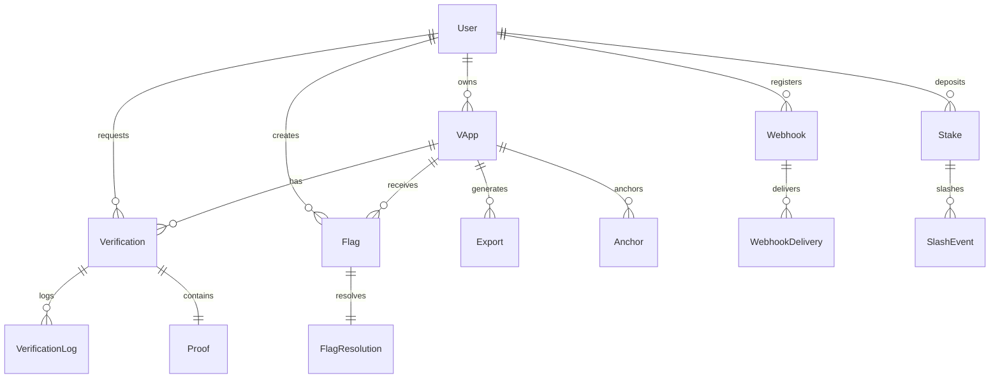

# OpenvApps Hub Database Documentation
This document provides comprehensive information about the OpenvApps Hub database schema, relationships, and best practices.
## 📊 Database Overview
OpenvApps Hub uses PostgreSQL as the primary database with Prisma as the ORM. The database is designed to handle:
- **vApp Management**: Application metadata and lifecycle
- **Proof Verification**: Zero-knowledge proof storage and verification results
- **User Management**: Authentication, authorization, and user profiles
- **Blockchain Integration**: Cross-chain proof anchoring and verification
- **Community Features**: Flags, stakes, and moderation
- **Webhook System**: Event notifications and delivery tracking
## 🏗️ Schema Overview

For more information about the OpenvApps Hub database, see:
- [API Documentation](API.md)
